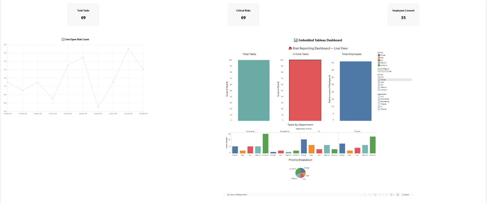

**Steps to run the project**

1. Git clone the repo to your local

2. Run the below command in root directory of project

   ```
   npm install
   ```

3. Start the project using the below command

   ```
   npm run start
   ```



🚀 **Live Demo**: [Click here to view](https://risk-dashboard-app.vercel.app)
